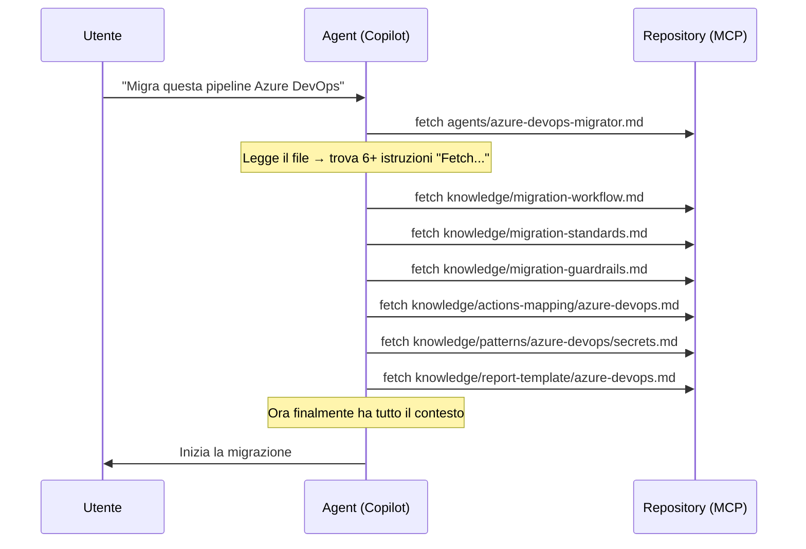
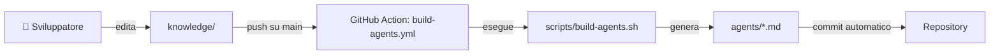
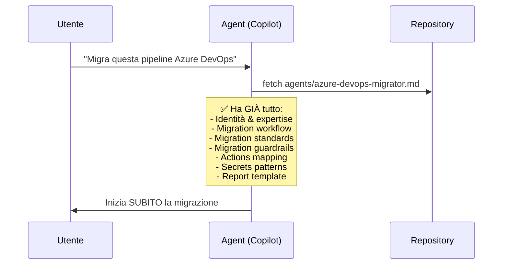

# 🏗️ Copilot Converter — Refactoring Architetturale

## Indice

- [Obiettivo](#-obiettivo)
- [Struttura Attuale](#-struttura-attuale-before)
- [Il Problema](#-il-problema-come-funziona-oggi)
- [Struttura Proposta](#-struttura-proposta-after)
- [Cosa Cambia (Diff Visuale)](#-cosa-cambia-diff-visuale)
- [Come Funziona il Nuovo Flusso](#-come-funziona-il-nuovo-flusso)
- [Lo Script di Build](#-lo-script-di-build)
- [Automazione con GitHub Actions](#-automazione-con-github-actions)
- [Riepilogo Vantaggi](#-riepilogo-vantaggi)

---

## 🎯 Obiettivo

Consolidare ogni agent file (es. `azure-devops-migrator.md`) in un **singolo file self-contained** che includa inline tutto il contenuto necessario — eliminando i riferimenti a `knowledge/` che oggi l'agent deve risolvere a runtime tramite fetch MCP.

La cartella `knowledge/` **resta la source of truth** dove si edita. I file `agents/` diventano **output generati** da uno script.

---

## 📂 Struttura Attuale (BEFORE)

```
copilot-converter/
│
├── .github/
│   ├── ISSUE_TEMPLATE/
│   │   ├── config.yml
│   │   ├── documentation.md
│   │   ├── knowledgebase.md
│   │   ├── migration_agent.md
│   │   └── migration_automation.md
│   ├── scripts/
│   │   ├── create-repo-vars.js
│   │   ├── load-config.js
│   │   ├── setup-custom-properties.js
│   │   └── submit-repositories.js
│   ├── settings/
│   │   └── config.yaml
│   ├── workflows/
│   │   ├── settings.yml
│   │   └── submit-repos.yml
│   ├── dependabot.yml
│   └── release.yml
│
├── agents/                                    ⚠️  SOLO PUNTATORI
│   ├── azure-devops-migrator.md               ← contiene "Fetch knowledge/..."
│   ├── bamboo-migrator.md                     ← contiene "Fetch knowledge/..."
│   ├── bitbucket-migrator.md                  ← contiene "Fetch knowledge/..."
│   ├── circleci-migrator.md                   ← contiene "Fetch knowledge/..."
│   ├── droneci-migrator.md                    ← contiene "Fetch knowledge/..."
│   ├── gitlab-migrator.md                     ← contiene "Fetch knowledge/..."
│   ├── jenkins-migrator.md                    ← contiene "Fetch knowledge/..."
│   ├── reusable-workflow-builder.md
│   └── travisci-migrator.md                   ← contiene "Fetch knowledge/..."
│
├── docs/
│   ├── deployment.md
│   ├── extending.md
│   └── operations.md
│
├── knowledge/                                 📚 SOURCE OF TRUTH
│   ├── README.md
│   ├── migration-workflow.md                  ← shared (tutti gli agent)
│   ├── migration-standards.md                 ← shared (tutti gli agent)
│   ├── migration-guardrails.md                ← shared (tutti gli agent)
│   │
│   ├── actions-mapping/                       ← 1 file per provider
│   │   ├── azure-devops.md
│   │   ├── bamboo.md
│   │   ├── bitbucket.md
│   │   ├── circleci.md
│   │   ├── droneci.md
│   │   ├── gitlab.md
│   │   ├── jenkins.md
│   │   └── travisci.md
│   │
│   ├── patterns/                              ← secrets + pattern per provider
│   │   ├── azure-devops/
│   │   │   └── secrets.md
│   │   ├── bamboo/
│   │   │   └── secrets.md
│   │   ├── bitbucket/
│   │   │   └── secrets.md
│   │   ├── circleci/
│   │   │   └── secrets.md
│   │   ├── droneci/
│   │   │   └── secrets.md
│   │   ├── gitlab/
│   │   │   └── secrets.md
│   │   ├── jenkins/
│   │   │   ├── groovy.md
│   │   │   ├── pipeline.md
│   │   │   └── secrets.md
│   │   └── travisci/
│   │       └── secrets.md
│   │
│   └── report-template/                       ← 1 template per provider
│       ├── azure-devops.md
│       ├── bamboo.md
│       ├── bitbucket.md
│       ├── circleci.md
│       ├── droneci.md
│       ├── gitlab.md
│       ├── jenkins.md
│       └── travisci.md
│
├── .gitignore
├── CODEOWNERS
├── CODE_OF_CONDUCT.md
├── CONTRIBUTING.md
├── LICENSE
├── README.md
├── SECURITY.md
└── SUPPORT.md
```

---

## ❌ Il Problema: Come Funziona Oggi

Quando un Copilot agent viene invocato, il flusso è questo:



### Problemi concreti

| # | Problema | Impatto |
|---|---------|---------|
| 1 | **6-7 round-trip MCP** prima di iniziare a lavorare | 🐌 Latenza elevata |
| 2 | L'agent potrebbe **saltare un fetch** o non eseguirlo | 🎰 Risultato inconsistente |
| 3 | Ogni fetch **consuma token** di contesto | 🔥 Spreco di risorse |
| 4 | Il placeholder `{MY_ORGANIZATION}` nel file agent | ❓ Se non configurato, fetch fallisce |
| 5 | L'agent deve **interpretare le istruzioni** di fetch | 🧠 Complessità inutile |

---

## ✅ Struttura Proposta (AFTER)

```
copilot-converter/
│
├── .github/
│   ├── ISSUE_TEMPLATE/                        (invariato)
│   │   ├── config.yml
│   │   ├── documentation.md
│   │   ├── knowledgebase.md
│   │   ├── migration_agent.md
│   │   └── migration_automation.md
│   ├── scripts/                               (invariato)
│   │   ├── create-repo-vars.js
│   │   ├── load-config.js
│   │   ├── setup-custom-properties.js
│   │   └── submit-repositories.js
│   ├── settings/                              (invariato)
│   │   └── config.yaml
│   ├── workflows/
│   │   ├── build-agents.yml                   🆕 CI: rigenera agents/ su push a knowledge/
│   │   ├── settings.yml
│   │   └── submit-repos.yml
│   ├── dependabot.yml
│   └── release.yml
│
├── agents/                                    ✅ FILE SELF-CONTAINED (generati)
│   ├── azure-devops-migrator.md               ← TUTTO inline, zero fetch
│   ├── bamboo-migrator.md                     ← TUTTO inline, zero fetch
│   ├── bitbucket-migrator.md                  ← TUTTO inline, zero fetch
│   ├── circleci-migrator.md                   ← TUTTO inline, zero fetch
│   ├── droneci-migrator.md                    ← TUTTO inline, zero fetch
│   ├── gitlab-migrator.md                     ← TUTTO inline, zero fetch
│   ├── jenkins-migrator.md                    ← TUTTO inline, zero fetch
│   ├── reusable-workflow-builder.md           (invariato, non è un migrator)
│   └── travisci-migrator.md                   ← TUTTO inline, zero fetch
│
├── docs/                                      (invariato)
│   ├── architecture-refactoring.md            🆕 Questo file
│   ├── deployment.md
│   ├── extending.md
│   └── operations.md
│
├── knowledge/                                 📚 SOURCE OF TRUTH (invariata)
│   ├── README.md
│   ├── migration-workflow.md
│   ├── migration-standards.md
│   ├── migration-guardrails.md
│   ├── agent-header/                          🆕 Header specifici per provider
│   │   ├── azure-devops.md
│   │   ├── bamboo.md
│   │   ├── bitbucket.md
│   │   ├── circleci.md
│   │   ├── droneci.md
│   │   ├── gitlab.md
│   │   ├── jenkins.md
│   │   └── travisci.md
│   ├── actions-mapping/                       (invariata)
│   │   ├── azure-devops.md
│   │   ├── bamboo.md
│   │   ├── bitbucket.md
│   │   ├── circleci.md
│   │   ├── droneci.md
│   │   ├── gitlab.md
│   │   ├── jenkins.md
│   │   └── travisci.md
│   ├── patterns/                              (invariata)
│   │   ├── azure-devops/
│   │   │   └── secrets.md
│   │   ├── bamboo/
│   │   │   └── secrets.md
│   │   ├── bitbucket/
│   │   │   └── secrets.md
│   │   ├── circleci/
│   │   │   └── secrets.md
│   │   ├── droneci/
│   │   │   └── secrets.md
│   │   ├── gitlab/
│   │   │   └── secrets.md
│   │   ├── jenkins/
│   │   │   ├── groovy.md
│   │   │   ├── pipeline.md
│   │   │   └── secrets.md
│   │   └── travisci/
│   │       └── secrets.md
│   └── report-template/                       (invariata)
│       ├── azure-devops.md
│       ├── bamboo.md
│       ├── bitbucket.md
│       ├── circleci.md
│       ├── droneci.md
│       ├── gitlab.md
│       ├── jenkins.md
│       └── travisci.md
│
├── scripts/
│   └── build-agents.sh                        🆕 Script di generazione
│
├── .gitignore
├── CODEOWNERS
├── CODE_OF_CONDUCT.md
├── CONTRIBUTING.md
├── LICENSE
├── README.md
├── SECURITY.md
└── SUPPORT.md
```

---

## 🔀 Cosa Cambia (Diff Visuale)

### File Nuovi (🆕)

| File | Scopo |
|------|-------|
| `scripts/build-agents.sh` | Assembla i file agent dai sorgenti in `knowledge/` |
| `.github/workflows/build-agents.yml` | Rigenera automaticamente gli agent su push a `knowledge/` |
| `knowledge/agent-header/{provider}.md` | Parte iniziale di ogni agent (identità, expertise) estratta dai file `agents/` attuali |
| `docs/architecture-refactoring.md` | Questo documento |

### File Modificati (✏️)

| File | Cambiamento |
|------|-------------|
| `agents/{provider}-migrator.md` | Da file con puntatori → file **self-contained generato** con tutto il contenuto inline |

### File Rimossi (🗑️)

Nessuno. Tutto il contenuto in `knowledge/` resta intatto.

### File Invariati (✅)

Tutto il resto: `.github/`, `docs/`, `knowledge/` (struttura e contenuto), file root.

---

## ⚙️ Come Funziona il Nuovo Flusso

### Flusso di Editing (umano)



1. Lo sviluppatore modifica un file in `knowledge/` (es. aggiunge un nuovo mapping)
2. Il push su `main` triggera la GitHub Action `build-agents.yml`
3. Lo script `build-agents.sh` legge tutti i sorgenti e rigenera i file `agents/`
4. I file aggiornati vengono committati automaticamente

### Flusso a Runtime (agent Copilot)



**Zero fetch aggiuntivi. Zero latenza. Zero rischio di dati mancanti.**

---

## 🔧 Lo Script di Build

### `scripts/build-agents.sh`

```bash
#!/bin/bash
set -euo pipefail

# ============================================================================
# build-agents.sh
# Genera i file agents/{provider}-migrator.md self-contained
# assemblando i sorgenti dalla knowledge base.
#
# Usage: ./scripts/build-agents.sh
# ============================================================================

SCRIPT_DIR="$(cd "$(dirname "${BASH_SOURCE[0]}")" && pwd)"
ROOT_DIR="$(dirname "$SCRIPT_DIR")"
KNOWLEDGE_DIR="$ROOT_DIR/knowledge"
AGENTS_DIR="$ROOT_DIR/agents"

# Providers e relativi file pattern
declare -A PROVIDERS=(
  [azure-devops]="azure-devops"
  [bamboo]="bamboo"
  [bitbucket]="bitbucket"
  [circleci]="circleci"
  [droneci]="droneci"
  [gitlab]="gitlab"
  [jenkins]="jenkins"
  [travisci]="travisci"
)

SEPARATOR="

---

"

for provider in "${!PROVIDERS[@]}"; do
  slug="${PROVIDERS[$provider]}"
  output="$AGENTS_DIR/${provider}-migrator.md"

  echo "🔨 Building: ${provider}-migrator.md"

  # Inizia con header vuoto
  > "$output"

  # 1. Agent Header (identità, expertise, processo specifico)
  header="$KNOWLEDGE_DIR/agent-header/${slug}.md"
  if [[ -f "$header" ]]; then
    cat "$header" >> "$output"
    echo "$SEPARATOR" >> "$output"
  else
    echo "⚠️  Missing: $header"
  fi

  # 2. Migration Workflow (shared)
  echo "# 📋 Migration Workflow" >> "$output"
  echo "" >> "$output"
  cat "$KNOWLEDGE_DIR/migration-workflow.md" >> "$output"
  echo "$SEPARATOR" >> "$output"

  # 3. Migration Standards (shared)
  echo "# 📏 Migration Standards & Deliverables" >> "$output"
  echo "" >> "$output"
  cat "$KNOWLEDGE_DIR/migration-standards.md" >> "$output"
  echo "$SEPARATOR" >> "$output"

  # 4. Migration Guardrails (shared)
  echo "# 🛡️ Migration Guardrails" >> "$output"
  echo "" >> "$output"
  cat "$KNOWLEDGE_DIR/migration-guardrails.md" >> "$output"
  echo "$SEPARATOR" >> "$output"

  # 5. Actions Mapping (provider-specific)
  mapping="$KNOWLEDGE_DIR/actions-mapping/${slug}.md"
  if [[ -f "$mapping" ]]; then
    echo "# 🔄 Actions Mapping" >> "$output"
    echo "" >> "$output"
    cat "$mapping" >> "$output"
    echo "$SEPARATOR" >> "$output"
  fi

  # 6. Patterns — include TUTTI i file .md nella cartella del provider
  pattern_dir="$KNOWLEDGE_DIR/patterns/${slug}"
  if [[ -d "$pattern_dir" ]]; then
    echo "# 🔐 Migration Patterns" >> "$output"
    echo "" >> "$output"
    for pattern_file in "$pattern_dir"/*.md; do
      if [[ -f "$pattern_file" ]]; then
        fname="$(basename "$pattern_file" .md)"
        echo "## Pattern: ${fname}" >> "$output"
        echo "" >> "$output"
        cat "$pattern_file" >> "$output"
        echo "" >> "$output"
      fi
    done
    echo "$SEPARATOR" >> "$output"
  fi

  # 7. Report Template (provider-specific)
  report="$KNOWLEDGE_DIR/report-template/${slug}.md"
  if [[ -f "$report" ]]; then
    echo "# 📄 Report Template" >> "$output"
    echo "" >> "$output"
    cat "$report" >> "$output"
    echo "" >> "$output"
  fi

  # Footer
  echo "---" >> "$output"
  echo "" >> "$output"
  echo "*⚠️ File auto-generato da \`scripts/build-agents.sh\`. Non editare direttamente — modificare i sorgenti in \`knowledge/\`.*" >> "$output"

  echo "✅ Done: $output"
done

echo ""
echo "🎉 All agent files generated successfully."
```

### Come viene assemblato un file agent

Per esempio, `agents/azure-devops-migrator.md` viene costruito così:

```
┌─────────────────────────────────────────────────────────────┐
│  knowledge/agent-header/azure-devops.md                     │  ← Identità, expertise
│  ─ ─ ─ ─ ─ ─ ─ ─ ─ ─ ─ ─ ─ ─ ─ ─ ─ ─ ─ ─ ─ ─ ─ ─ ─ ─  │
│  knowledge/migration-workflow.md                            │  ← Processo 5 fasi (shared)
│  ─ ─ ─ ─ ─ ─ ─ ─ ─ ─ ─ ─ ─ ─ ─ ─ ─ ─ ─ ─ ─ ─ ─ ─ ─ ─  │
│  knowledge/migration-standards.md                           │  ← Standard qualità (shared)
│  ─ ─ ─ ─ ─ ─ ─ ─ ─ ─ ─ ─ ─ ─ ─ ─ ─ ─ ─ ─ ─ ─ ─ ─ ─ ─  │
│  knowledge/migration-guardrails.md                          │  ← Sicurezza e limiti (shared)
│  ─ ─ ─ ─ ─ ─ ─ ─ ─ ─ ─ ─ ─ ─ ─ ─ ─ ─ ─ ─ ─ ─ ─ ─ ─ ─  │
│  knowledge/actions-mapping/azure-devops.md                  │  ← Mappature task (specifico)
│  ─ ─ ─ ─ ─ ─ ─ ─ ─ ─ ─ ─ ─ ─ ─ ─ ─ ─ ─ ─ ─ ─ ─ ─ ─ ─  │
│  knowledge/patterns/azure-devops/secrets.md                 │  ← Pattern secrets (specifico)
│  ─ ─ ─ ─ ─ ─ ─ ─ ─ ─ ─ ─ ─ ─ ─ ─ ─ ─ ─ ─ ─ ─ ─ ─ ─ ─  │
│  knowledge/report-template/azure-devops.md                  │  ← Template report (specifico)
└─────────────────────────────────────────────────────────────┘
                          ↓ output
              agents/azure-devops-migrator.md
```

### Caso speciale: Jenkins

Jenkins ha **3 file pattern** (`groovy.md`, `pipeline.md`, `secrets.md`) anziché solo `secrets.md`. Lo script li include **tutti automaticamente** grazie al glob `$pattern_dir/*.md`.

---

## 🤖 Automazione con GitHub Actions

### `.github/workflows/build-agents.yml`

```yaml
name: Build Agent Files

on:
  push:
    branches: [main]
    paths:
      - 'knowledge/**'
  workflow_dispatch:

permissions:
  contents: write

jobs:
  build:
    runs-on: ubuntu-latest
    steps:
      - uses: actions/checkout@v4

      - name: Build agent files
        run: |
          chmod +x scripts/build-agents.sh
          ./scripts/build-agents.sh

      - name: Check for changes
        id: changes
        run: |
          git diff --quiet agents/ && echo "changed=false" >> "$GITHUB_OUTPUT" || echo "changed=true" >> "$GITHUB_OUTPUT"

      - name: Commit and push
        if: steps.changes.outputs.changed == 'true'
        run: |
          git config user.name "github-actions[bot]"
          git config user.email "github-actions[bot]@users.noreply.github.com"
          git add agents/
          git commit -m "chore: rebuild agent files from knowledge base"
          git push
```

### Trigger

| Evento | Quando |
|--------|--------|
| `push` su `knowledge/**` | Qualsiasi modifica ai file sorgente |
| `workflow_dispatch` | Rebuild manuale da UI GitHub Actions |

### Cosa fa

1. Checkout del repo
2. Esegue `build-agents.sh`
3. Se ci sono differenze in `agents/` → commit e push automatico
4. Se non ci sono differenze → nessun commit (idempotente)

---

## ✅ Riepilogo Vantaggi

### Prima vs Dopo

| Aspetto | ❌ Prima (oggi) | ✅ Dopo (proposta) |
|---------|-----------------|-------------------|
| **Fetch a runtime** | 6-7 chiamate MCP per agent | **0** — tutto inline |
| **Latenza agent** | Alta (attende fetch) | **Minima** — legge 1 file |
| **Rischio fetch falliti** | Possibile ad ogni chiamata | **Zero** — nessun fetch |
| **Placeholder `{MY_ORGANIZATION}`** | Deve essere configurato | **Eliminato** |
| **Consistenza** | L'agent potrebbe saltare un file | **Garantita** — file completo o niente |
| **Source of truth** | `knowledge/` (ma agent non la usa direttamente bene) | `knowledge/` (immutata, effettivamente centrale) |
| **Manutenzione** | Editare `knowledge/` + sperare che l'agent li fetchi | Editare `knowledge/` → script rigenera tutto |
| **Aggiungere un provider** | Creare 4+ file + agent con puntatori | Creare i file in `knowledge/` + aggiungere al loop dello script |

### Cosa NON cambia

- ✅ `knowledge/` resta la **single source of truth**
- ✅ Nessun file esistente viene eliminato
- ✅ La struttura delle cartelle `knowledge/` resta **identica**
- ✅ `reusable-workflow-builder.md` non viene toccato (non è un migrator provider-specific)
- ✅ Tutti gli altri file del repo (`.github/`, `docs/`, root) restano invariati

---

*Documento creato il 2026-05-26 — Proposta di refactoring per copilot-converter*
