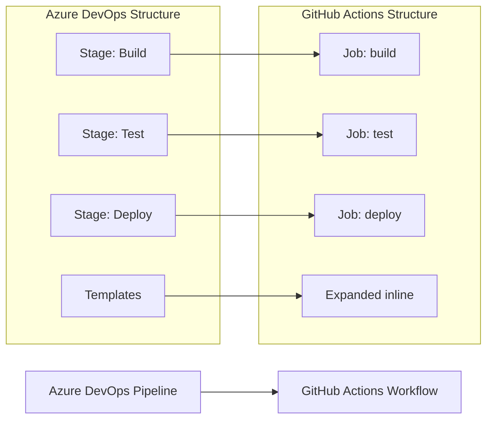

# 📄 MIGRATION REPORT TEMPLATE

Use the following content in `.github/ci-archive/MIGRATION-README.md` and as the Pull Request body:

````markdown
# 🚀 Azure DevOps to GitHub Actions Migration Report

## 📊 Migration Overview

| Metric          | Before (Azure DevOps) | After (GitHub Actions) |
| --------------- | --------------------- | ---------------------- |
| Pipeline Files  | X files               | Y workflows            |
| Pipeline Stages | X stages              | Y jobs                 |
| Pipeline Jobs   | X jobs                | Y jobs/Z steps         |
| Templates       | X templates           | Expanded inline        |

## 🔄 Conversion Diagram



## 🔧 Key Transformations

### Stage/Job Conversions

- Azure DevOps stages → GitHub Actions jobs with `needs:` dependencies
- Azure DevOps jobs → GitHub Actions job steps
- Template expansions → Inline workflow code
- Pool specifications → `runs-on:` runner selections
- Azure DevOps tasks → Equivalent GitHub Actions or shell commands

### Task and Variable Mappings

- `NodeTool@0` → `actions/setup-node@v4`
- `DotNetCoreCLI@2` → `actions/setup-dotnet@v4` + `run` commands
- `PublishBuildArtifacts@1` → `actions/upload-artifact@v4`
- `DownloadBuildArtifacts@1` → `actions/download-artifact@v4`
- Variable groups → Environment variables and organization/repository secrets and variables
- Deployment environments → GitHub Actions environments with protection rules

### Structural Changes

- Expanded all template references inline
- Converted `dependsOn:` to `needs:` for job dependencies
- Enhanced security with proper secret and variable management
- Added environment protection rules for deployments
- Improved artifact management between jobs

## ✅ Validation Results

### Linting Results

```
[VALIDATION_OUTPUT_ACTIONLINT]
```

### Manual Verification Checklist

- [x] YAML syntax validated
- [x] All actions properly versioned
- [x] Job dependencies verified
- [x] Environment variables migrated
- [x] Secrets and variables properly referenced
- [x] Triggers match original behavior

## 🔐 Security Improvements

- Migrated Azure DevOps variables and secrets to GitHub Secrets for secure credential management
- Migrated Azure DevOps configuration variables to GitHub Variables for non-sensitive settings
- Implemented least-privilege permissions model with GitHub token permissions
- Added security scanning integration with marketplace actions
- Enhanced artifact management with proper secret and variable handling
- Used verified marketplace actions for secure integrations
- Separated sensitive credentials into appropriate secret scopes

## 📈 Performance Enhancements

- Added intelligent caching for dependencies and build artifacts
- Optimized job parallelization where dependencies allow
- Reduced build time through efficient marketplace actions
- Implemented proper artifact sharing between jobs

## 🔗 Variable and Secret Requirements

### Required GitHub Secrets

- `DATABASE_CONNECTION_STRING` - Database connection string (from Azure DevOps variable groups)
- `API_KEY` - Application API key
- `DEPLOYMENT_TOKEN` - Deployment service token
- [List other project-specific secrets migrated from Azure DevOps]

### Required GitHub Variables

- `BUILD_CONFIGURATION` - Build configuration (Release/Debug)
- `API_ENDPOINT` - Application API endpoint
- `TARGET_ENVIRONMENT` - Deployment target environment
- [List other project-specific variables migrated from Azure DevOps]

## 🎯 Next Steps

1. **Configure secrets and variables** in GitHub repository settings
2. **Test the workflow** by pushing to a feature branch
3. **Monitor execution** for any runtime issues
4. **Update team documentation** with new workflow information
5. **Train team members** on GitHub Actions workflow process

## 📁 Original Azure DevOps Files

The original Azure DevOps pipeline files have been moved to `.github/ci-archive/` for reference:

- `azure-pipelines.yml` → [`.github/ci-archive/azure-pipelines.yml`](.github/ci-archive/azure-pipelines.yml)
- Pipeline templates → [`.github/ci-archive/`](.github/ci-archive/) with preserved structure

## 📚 Migration Notes

[Include any specific notes about decisions made during migration,
 potential issues to watch for, or special considerations for this project]

---
*Migration completed by GitHub Copilot Azure DevOps Migration Agent*

````
