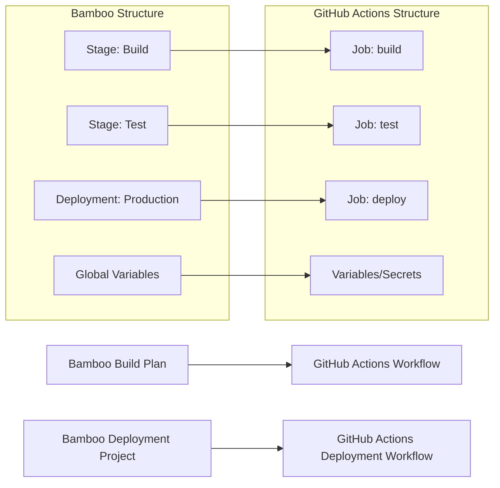

# 📄 MIGRATION REPORT TEMPLATE

Use the following as both the Pull Request body and the contents of `.github/ci-archive/MIGRATION-README.md` (create the file if it does not exist):

````markdown
# 🚀 Bamboo to GitHub Actions Migration Report

## 📊 Migration Overview

| Metric              | Before (Bamboo) | After (GitHub Actions) |
| ------------------- | --------------- | ---------------------- |
| Build Plans         | X plans         | Y workflows            |
| Deployment Projects | X projects      | Y deployment workflows |
| Build Jobs          | X jobs          | Y jobs/Z steps         |
| Global Variables    | X variables     | Y variables/Z secrets  |

## 🔄 Conversion Diagram



## 🔧 Key Transformations

### Build Plan Conversions

- Bamboo stages → GitHub Actions jobs with `needs:` dependencies
- Bamboo jobs → GitHub Actions job steps
- Bamboo tasks → Equivalent GitHub Actions or shell commands
- Agent capabilities → `runs-on:` runner selections
- Plan dependencies → Job dependencies with `needs:`

### Task and Variable Mappings

- `script` tasks → `run` steps
- `artifact-definition` → `actions/upload-artifact@v4`
- `artifact-download` → `actions/download-artifact@v4`
- `checkout` tasks → `actions/checkout@v4`
- Global variables → GitHub Variables and Secrets
- Repository polling → GitHub webhook triggers

### Structural Changes

- Expanded all shared configurations inline
- Converted plan dependencies to job dependencies
- Enhanced security with proper secret and variable management
- Added environment protection rules for deployments
- Improved artifact management between jobs
- Enhanced test result processing

## ✅ Validation Results

### Linting Results

```
[VALIDATION_OUTPUT_ACTIONLINT]
```

### Manual Verification Checklist

- [x] YAML syntax validated
- [x] All actions properly versioned with latest stable versions
- [x] Job dependencies verified
- [x] Environment variables migrated
- [x] Secrets and variables properly referenced
- [x] Bamboo tasks converted to GitHub Actions
- [x] Deployment environments configured
- [x] Triggers match original behavior
- [x] Artifact handling works correctly

## 🔐 Security Improvements

- Migrated Bamboo global variables to GitHub Secrets and Variables for secure management
- Implemented least-privilege permissions model with GitHub token permissions
- Added security scanning integration with marketplace actions
- Enhanced artifact management with proper secret and variable handling
- Used verified marketplace actions for secure integrations
- Configured environment protection rules for deployments
- Separated sensitive credentials from configuration using appropriate storage types
- Replaced Bamboo-specific tooling with secure cross-platform alternatives

## 📈 Performance Enhancements

- Added intelligent caching for dependencies and build artifacts
- Optimized job parallelization where dependencies allow
- Reduced build time through efficient marketplace actions
- Implemented proper artifact sharing between jobs
- Enhanced deployment speed with streamlined workflows
- Improved test result processing and reporting

## 🔗 Variable and Secret Requirements

### Required GitHub Secrets

- `DATABASE_PASSWORD` - Database connection password (from Bamboo global variables)
- `API_SECRET_KEY` - Application API secret key
- `DEPLOYMENT_TOKEN` - Deployment service token
- [List other project-specific secrets migrated from Bamboo]

### Required GitHub Variables

- `API_ENDPOINT` - Application API endpoint URL
- `BUILD_CONFIGURATION` - Build configuration (release/debug)
- `TARGET_ENVIRONMENT` - Deployment target environment
- `NOTIFICATION_CHANNEL` - Notification channel for build results
- [List other project-specific variables migrated from Bamboo]

## 🎯 Next Steps

1. **Configure secrets and variables** in GitHub repository settings
2. **Set up environments** with appropriate protection rules
3. **Install any required tools** that replaced Bamboo tasks
4. **Configure notification integrations** to replace HipChat/email notifications
5. **Test the workflows** by pushing to a feature branch
6. **Monitor execution** for any runtime issues
7. **Update deployment scripts** to work with new tooling
8. **Update team documentation** with new workflow information
9. **Train team members** on GitHub Actions workflow process

## 📁 Original Bamboo Files

The original Bamboo configuration files have been moved to `.github/ci-archive/` for reference:

- `bamboo-specs/` → [`.github/ci-archive/bamboo-specs/`](.github/ci-archive/bamboo-specs/)
- Build plans → [`.github/ci-archive/`](.github/ci-archive/)
- Deployment projects → [`.github/ci-archive/`](.github/ci-archive/)

## 📚 Migration Notes

[Include any specific notes about decisions made during migration,
 build plan conversions performed, Bamboo task mappings,
 agent capability replacements, notification integration changes,
 potential issues to watch for, or special considerations for this project]

---
*Migration completed by GitHub Copilot Bamboo Migration Agent*

````
