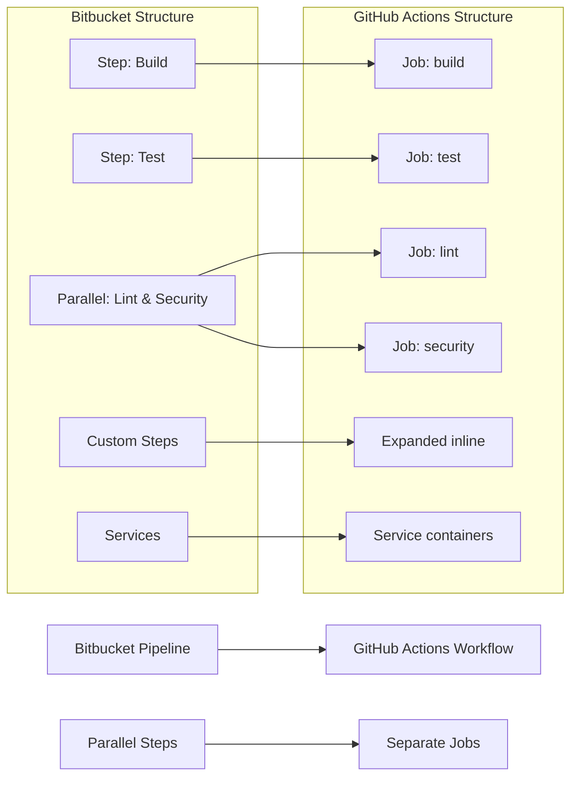

# 📄 MIGRATION REPORT TEMPLATE

Use the following as the Pull Request body and as the contents of `.github/ci-archive/MIGRATION-README.md`:

````markdown
# 🚀 Bitbucket Pipelines to GitHub Actions Migration Report

## 📊 Migration Overview

| Metric            | Before (Bitbucket) | After (GitHub Actions) |
| ----------------- | ------------------ | ---------------------- |
| Pipeline Files    | X files            | Y workflows            |
| Pipeline Steps    | X steps            | Y jobs/Z steps         |
| Parallel Sections | X parallel blocks  | Y separate jobs        |
| Custom Steps      | X custom steps     | Expanded inline        |
| Services          | X services         | Y service containers   |

## 🔄 Conversion Diagram



## 🔧 Key Transformations

### Step Conversions

- Bitbucket steps → GitHub Actions jobs and steps
- Parallel sections → Separate jobs with dependency management
- Custom steps → Expanded inline workflow code
- Container images → `runs-on` with container specifications
- Bitbucket services → GitHub Actions service containers

### Variable and Secret Mappings

- Secured repository variables → GitHub Secrets
- Regular repository variables → GitHub Variables
- Deployment variables → Environment-specific variables/secrets
- Built-in variables → GitHub context variables (`github.run_number`, etc.)

### Service and Environment Mappings

- Bitbucket services → GitHub Actions service containers
- Deployment environments → GitHub Actions environments with protection rules
- Cache definitions → GitHub Actions cache actions
- Manual triggers → GitHub Actions workflow_dispatch

### Structural Changes

- Expanded all custom step references inline
- Converted parallel execution to separate jobs with proper dependencies
- Enhanced security with proper secret and variable management
- Added environment protection rules for deployments
- Improved artifact management between jobs
- Enhanced caching strategies with GitHub Actions cache

## ✅ Validation Results

### Linting Results

```
[VALIDATION_OUTPUT_ACTIONLINT]
```

### Manual Verification Checklist

- [x] YAML syntax validated
- [x] All actions properly versioned with latest stable versions
- [x] Job dependencies verified for parallel execution conversion
- [x] Environment variables migrated
- [x] Secrets and variables properly referenced
- [x] Bitbucket steps converted to GitHub Actions
- [x] Service containers configured correctly
- [x] Caching strategies implemented
- [x] Deployment environments configured
- [x] Triggers match original behavior
- [x] Custom steps expanded inline

## 🔐 Security Improvements

- Migrated Bitbucket secured variables to GitHub Secrets for secure credential management
- Migrated regular Bitbucket variables to GitHub Variables for non-sensitive configuration
- Implemented least-privilege permissions model with GitHub token permissions
- Added security scanning integration with marketplace actions
- Enhanced artifact management with proper secret and variable handling
- Used verified marketplace actions for secure integrations
- Configured environment protection rules for deployments
- Separated sensitive credentials from configuration using appropriate storage types
- Replaced Bitbucket-specific configurations with secure GitHub Actions equivalents

## 📈 Performance Enhancements

- Added intelligent caching for dependencies and build artifacts using GitHub Actions cache
- Optimized job parallelization by converting Bitbucket parallel sections to separate jobs
- Reduced build time through efficient marketplace actions
- Implemented proper artifact sharing between jobs
- Enhanced deployment speed with streamlined workflows
- Improved service container configuration for better performance

## 🔗 Variable and Secret Requirements

### Required GitHub Secrets

- `DATABASE_PASSWORD` - Database connection password (from Bitbucket secured variables)
- `API_SECRET_KEY` - Application API secret key
- `DEPLOYMENT_TOKEN` - Deployment service token
- `DOCKER_HUB_PASSWORD` - Docker Hub authentication
- [List other project-specific secrets migrated from Bitbucket]

### Required GitHub Variables

- `API_ENDPOINT` - Application API endpoint URL
- `BUILD_CONFIGURATION` - Build configuration (release/debug)
- `TARGET_ENVIRONMENT` - Deployment target environment
- `CACHE_VERSION` - Cache versioning for cache invalidation
- `DOCKER_HUB_USERNAME` - Docker Hub username
- [List other project-specific variables migrated from Bitbucket]

## 🎯 Next Steps

1. **Configure secrets and variables** in GitHub repository settings
2. **Set up environments** with appropriate protection rules matching Bitbucket deployment environments
3. **Configure service containers** to replace Bitbucket services
4. **Test caching strategies** to ensure proper dependency and artifact caching
5. **Verify parallel job execution** matches original Bitbucket parallel behavior
6. **Test the workflows** by pushing to a feature branch
7. **Monitor execution** for any runtime issues or performance differences
8. **Update deployment scripts** to work with new environment configurations
9. **Update team documentation** with new workflow information
10. **Train team members** on GitHub Actions workflow process

## 📁 Original Bitbucket Files

The original Bitbucket Pipelines configuration files have been moved to `.github/ci-archive/` for reference:

- `bitbucket-pipelines.yml` → [`.github/ci-archive/bitbucket-pipelines.yml`](.github/ci-archive/bitbucket-pipelines.yml)
- Custom steps → [`.github/ci-archive/custom-steps/`](.github/ci-archive/custom-steps/)

## 📚 Migration Notes

[Include any specific notes about decisions made during migration,
 custom step expansions performed, parallel execution conversions,
 service container configurations, caching strategy changes,
 potential issues to watch for, or special considerations for this project]

---
*Migration completed by GitHub Copilot Bitbucket Pipelines Migration Agent*

````
