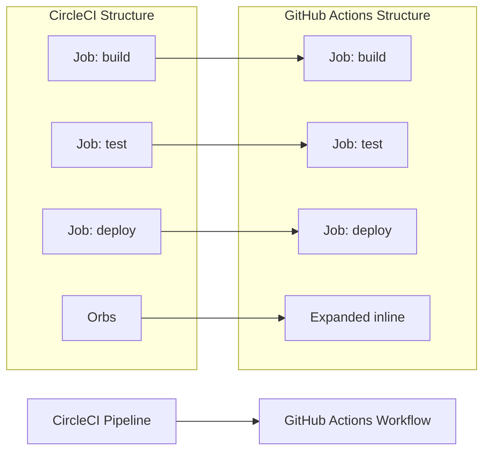

# 📄 MIGRATION REPORT TEMPLATE

Use the following content both as the Pull Request body and as the contents of `.github/ci-archive/MIGRATION-README.md`:

````markdown
# 🚀 CircleCI to GitHub Actions Migration Report

## 📊 Migration Overview

| Metric              | Before (CircleCI) | After (GitHub Actions) |
| ------------------- | ----------------- | ---------------------- |
| Configuration Files | X files           | Y workflows            |
| Workflows           | X workflows       | Y workflows            |
| Jobs                | X jobs            | Y jobs/Z steps         |
| Orbs                | X orbs            | Expanded inline        |

## 🔄 Conversion Diagram



## 🔧 Key Transformations

### Job Conversions

- CircleCI executors → GitHub Actions `runs-on:` and `container:`
- CircleCI orbs → Expanded inline or marketplace actions
- CircleCI commands → Reusable steps or composite actions
- CircleCI workflow dependencies → GitHub Actions `needs:`

### Orb and Context Mappings

- `circleci/node@x` → `actions/setup-node@v4`
- `circleci/aws-cli@x` → `aws-actions/configure-aws-credentials@v4`
- `circleci/docker@x` → `docker/build-push-action@v5`
- CircleCI contexts → GitHub Secrets and Variables
- Environment variables → GitHub Variables for non-sensitive, Secrets for sensitive data

### Structural Changes

- Expanded all orb references inline
- Converted `requires:` to `needs:` for job dependencies
- Enhanced security with proper secret and variable management
- Added environment protection rules for deployments
- Improved caching with GitHub Actions cache patterns

## ✅ Validation Results

### Linting Results

```
[VALIDATION_OUTPUT_ACTIONLINT]
```

### Manual Verification Checklist

- [x] YAML syntax validated
- [x] All actions properly versioned
- [x] Job dependencies verified
- [x] Environment variables migrated
- [x] Secrets and variables properly referenced
- [x] Triggers match original behavior

## 🔐 Security Improvements

- Migrated CircleCI contexts to GitHub Secrets for secure credential management
- Migrated CircleCI environment variables to GitHub Variables for non-sensitive configuration
- Implemented least-privilege permissions model with GitHub token permissions
- Added security scanning integration with marketplace actions
- Enhanced artifact management with proper secret and variable handling
- Used verified marketplace actions for secure integrations
- Separated sensitive credentials from configuration using appropriate storage types

## 📈 Performance Enhancements

- Added intelligent caching for dependencies and build artifacts
- Optimized job parallelization with proper dependency management
- Reduced build time through efficient GitHub Actions
- Implemented proper artifact sharing between jobs

## 🔗 Variable and Secret Requirements

### Required GitHub Secrets

- `AWS_ACCESS_KEY_ID` - AWS access key for deployments (from CircleCI context)
- `AWS_SECRET_ACCESS_KEY` - AWS secret key for deployments
- `DOCKER_USER` - Docker Hub username
- `DOCKER_PASS` - Docker Hub password or access token
- [List other project-specific secrets migrated from CircleCI]

### Required GitHub Variables

- `AWS_REGION` - AWS deployment region
- `BUILD_CONFIGURATION` - Build configuration (release/debug)
- `API_ENDPOINT` - Application API endpoint
- [List other project-specific variables migrated from CircleCI]

## 🎯 Next Steps

1. **Configure secrets and variables** in GitHub repository settings
2. **Test the workflow** by pushing to a feature branch
3. **Monitor execution** for any runtime issues
4. **Update team documentation** with new workflow information
5. **Train team members** on GitHub Actions workflow process

## 📁 Original CircleCI Files

The original CircleCI configuration files have been moved to `.github/ci-archive/` for reference:

- `.circleci/config.yml` → [`.github/ci-archive/circleci-config.yml`](.github/ci-archive/circleci-config.yml)

## 📚 Migration Notes

[Include any specific notes about decisions made during migration,
 potential issues to watch for, or special considerations for this project]

---
*Migration completed by GitHub Copilot CircleCI Migration Agent*

````
