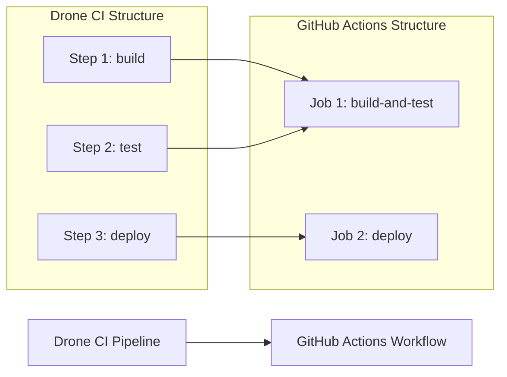

# 📄 MIGRATION REPORT TEMPLATE

Use the following as both the Pull Request body and the contents of `.github/ci-archive/MIGRATION-README.md`:

````markdown
# 🚀 Drone CI to GitHub Actions Migration Report

## 📊 Migration Overview

| Metric         | Before (Drone CI) | After (GitHub Actions) |
| -------------- | ----------------- | ---------------------- |
| Pipeline Files | X files           | Y workflows            |
| Pipeline Steps | X steps           | Y jobs/Z steps         |

## 🔄 Conversion Diagram



## 🔧 Key Transformations

### Step Conversions

- `docker` steps → `docker/build-push-action@v5`
- `slack` notification steps → `8398a7/action-slack@v3`
- Custom command steps → `run` steps
- Multi-command steps → combined job steps

### Environment Variable and Secret Mappings

- Drone CI secrets → GitHub Secrets for sensitive data
- Drone CI environment variables → GitHub Variables for non-sensitive configuration
- Environment-specific configuration → Repository or organization variables/secrets
- Build metadata → GitHub context variables (`github.run_number`, etc.)

### Structural Changes

- Combined sequential steps into single jobs where appropriate
- Improved caching with GitHub Actions cache
- Enhanced security with proper secret and variable management
- Added environment protection rules

## ✅ Validation Results

### Linting Results

```
[VALIDATION_OUTPUT_ACTIONLINT]
```

### Manual Verification Checklist

- [x] YAML syntax validated
- [x] All actions properly versioned
- [x] Job dependencies verified
- [x] Environment variables migrated
- [x] Secrets and variables properly referenced
- [x] Triggers match original behavior

## 🔐 Security Improvements

- Migrated Drone secrets to GitHub Secrets for secure credential management
- Migrated Drone environment variables to GitHub Variables for non-sensitive configuration
- Implemented least-privilege permissions model with GitHub token permissions
- Added security scanning integration with marketplace actions
- Enhanced artifact management with proper secret and variable handling
- Used verified marketplace actions for secure integrations
- Separated sensitive credentials from configuration using appropriate storage types

## 📈 Performance Enhancements

- Added intelligent caching for dependencies
- Optimized job parallelization
- Reduced build time through efficient actions
- Implemented proper artifact sharing

## 🔗 Variable and Secret Requirements

### Required GitHub Secrets

- `API_SECRET` - Application API secret key (from Drone CI secrets)
- `DATABASE_PASSWORD` - Database connection password
- `DEPLOYMENT_TOKEN` - Deployment service token
- [List other project-specific secrets migrated from Drone CI]

### Required GitHub Variables

- `API_ENDPOINT` - Application API endpoint URL
- `BUILD_CONFIGURATION` - Build configuration (release/debug)
- `TARGET_ENVIRONMENT` - Deployment target environment
- [List other project-specific variables migrated from Drone CI]

## 🎯 Next Steps

1. **Configure secrets and variables** in GitHub repository settings
2. **Test the workflow** by pushing to a feature branch
3. **Monitor execution** for any runtime issues
4. **Update team documentation** with new workflow information
5. **Train team members** on GitHub Actions workflow process

## 📁 Original Drone CI Files

The original Drone CI configuration files have been moved to `.github/ci-archive/` for reference:

- `.drone.yml` → [`.github/ci-archive/.drone.yml`](.github/ci-archive/.drone.yml)

## 📚 Migration Notes

[Include any specific notes about decisions made during migration,
 potential issues to watch for, or special considerations for this project]

---
*Migration completed by GitHub Copilot Drone CI Migration Agent*

````
