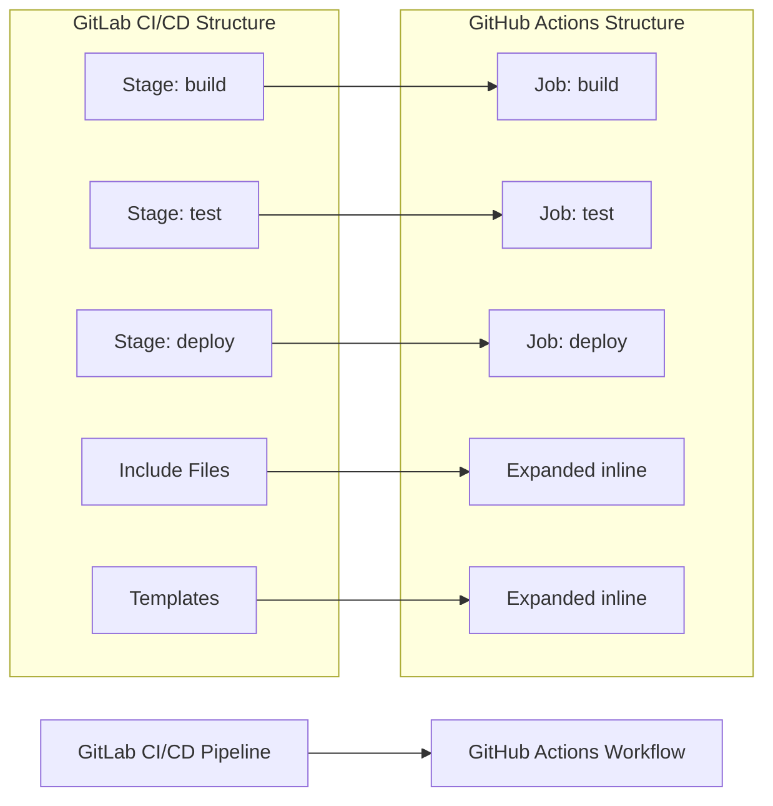

# 📄 MIGRATION REPORT TEMPLATE

Use the following as the Pull Request body and also save the completed report to `.github/ci-archive/MIGRATION-README.md` in the repository:

````markdown
# 🚀 GitLab CI/CD to GitHub Actions Migration Report

## 📊 Migration Overview

| Metric          | Before (GitLab CI/CD) | After (GitHub Actions) |
| --------------- | --------------------- | ---------------------- |
| Pipeline Files  | X files               | Y workflows            |
| Pipeline Stages | X stages              | Y jobs                 |
| Pipeline Jobs   | X jobs                | Y jobs/Z steps         |
| Include Files   | X includes            | Expanded inline        |
| Templates       | X templates           | Expanded inline        |

## 🔄 Conversion Diagram



## 🔧 Key Transformations

### Stage/Job Conversions

- GitLab stages → GitHub Actions jobs with `needs:` dependencies
- GitLab jobs → GitHub Actions job steps
- Include expansions → Inline workflow code
- Template expansions → Inline workflow code
- GitLab rules → GitHub Actions `if:` conditions
- GitLab services → GitHub Actions services configuration

### Variable and Environment Mappings

- GitLab variables → GitHub Actions environment variables and secrets
- GitLab predefined variables → GitHub context variables (`github.*`)
- GitLab environments → GitHub Actions environments with protection rules
- GitLab masked variables → GitHub Actions secrets
- Project/group/instance variables → Repository/organization secrets and variables

### Structural Changes

- Expanded all include statements inline
- Expanded all template references inline
- Converted stage dependencies to job `needs:` dependencies
- Enhanced security with proper secret management
- Added environment protection rules for deployments
- Improved artifact and cache management between jobs
- Converted GitLab-specific functions to GitHub equivalents

## ✅ Validation Results

### Linting Results

```
[VALIDATION_OUTPUT_ACTIONLINT]
```

### Manual Verification Checklist

- [x] YAML syntax validated
- [x] All actions properly versioned with latest stable versions
- [x] Job dependencies verified
- [x] Environment variables migrated
- [x] Secrets properly referenced
- [x] GitLab rules converted to GitHub Actions conditions
- [x] GitLab services converted to GitHub Actions services
- [x] Environment protection rules configured
- [x] Cache and artifact configurations validated
- [x] Includes and templates expanded inline
- [x] Triggers match original behavior

## 🔐 Security Improvements

- Migrated GitLab variables and secrets to GitHub Secrets for secure credential management
- Migrated non-sensitive GitLab variables to GitHub Variables for configuration management
- Implemented least-privilege permissions model with GitHub token permissions
- Added security scanning integration with marketplace actions
- Enhanced artifact management with proper secret handling
- Used verified marketplace actions for secure integrations
- Configured environment protection rules for deployments
- Separated sensitive credentials into appropriate secret scopes
- Replaced GitLab-specific functions with secure GitHub context equivalents
- Applied branch protection rules matching GitLab protected variable behavior

## 📈 Performance Enhancements

- Added intelligent caching for dependencies and build artifacts
- Optimized job parallelization where dependencies allow
- Reduced build time through efficient marketplace actions
- Implemented proper artifact sharing between jobs
- Enhanced deployment speed with streamlined workflows
- Improved container and service startup times
- Converted GitLab parallel matrix to GitHub Actions strategy matrix

## 🔗 Variable and Secret Requirements

### Required GitHub Secrets

- `DATABASE_PASSWORD` - Database connection password (from GitLab masked variables)
- `API_SECRET_KEY` - Application API secret key
- `DEPLOYMENT_TOKEN` - Deployment service token
- `DOCKER_PASSWORD` - Docker registry password
- [List other project-specific secrets migrated from GitLab variables]

### Required GitHub Variables

- `NODE_ENV` - Node.js environment configuration
- `API_ENDPOINT` - Application API endpoint
- `BUILD_CONFIGURATION` - Build configuration setting
- `DOCKER_USERNAME` - Docker registry username
- [List other project-specific variables migrated from GitLab variables]

## 🎯 Next Steps

1. **Configure secrets and variables** in GitHub repository settings
2. **Set up environments** with appropriate protection rules matching GitLab environments
3. **Configure services** if needed for database or external service dependencies
4. **Test the workflow** by pushing to a feature branch
5. **Monitor execution** for any runtime issues
6. **Update deployment scripts** to work with GitHub Actions context
7. **Configure branch protection rules** to match GitLab merge request requirements
8. **Update team documentation** with new workflow information
9. **Train team members** on GitHub Actions workflow process
10. **Review and update CI/CD badges** in README and documentation

## 📁 Original GitLab CI/CD Files

The original GitLab CI/CD pipeline files have been moved to `.github/ci-archive/` for reference:

- `.gitlab-ci.yml` → [`.github/ci-archive/.gitlab-ci.yml`](.github/ci-archive/.gitlab-ci.yml)
- Include files → [`.github/ci-archive/.gitlab/`](.github/ci-archive/.gitlab/)
- Templates → [`.github/ci-archive/`](.github/ci-archive/) with preserved structure

## 📚 Migration Notes

[Include any specific notes about decisions made during migration,
 template and include expansions performed, GitLab rule conversions,
 service and container configurations, variable mappings,
 potential issues to watch for, or special considerations for this project]

---
*Migration completed by GitHub Copilot GitLab CI/CD Migration Agent*

````
