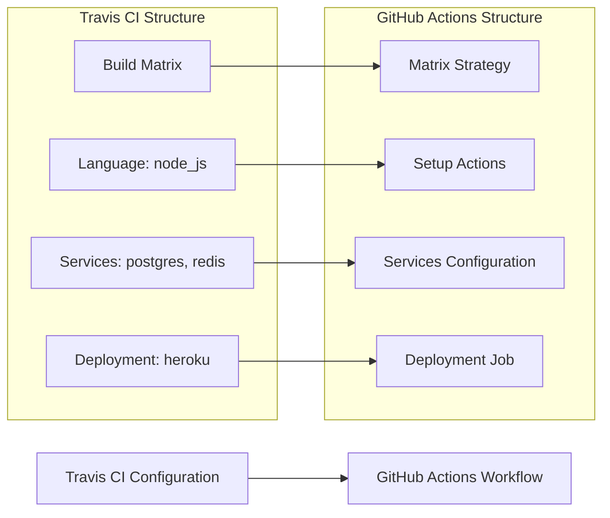

# 📄 MIGRATION REPORT TEMPLATE

Use the following content both as the Pull Request body and as the contents of `.github/ci-archive/MIGRATION-README.md` (they must stay in sync):

````markdown
# 🚀 Travis CI to GitHub Actions Migration Report

## 📊 Migration Overview

| Metric               | Before (Travis CI) | After (GitHub Actions) |
| -------------------- | ------------------ | ---------------------- |
| Configuration Files  | X files            | Y workflows            |
| Build Matrix         | X dimensions       | Y matrix strategies    |
| Build Stages         | X stages           | Y jobs                 |
| Service Dependencies | X services         | Y services             |
| Deployment Providers | X providers        | Y deployment jobs      |
| Encrypted Variables  | X variables        | Y secrets/variables    |

## 🔄 Conversion Diagram



## 🔧 Key Transformations

### Build Matrix Conversions

- Travis CI build matrix → GitHub Actions matrix strategy
- Language specifications → Setup actions (setup-node, setup-python, etc.)
- Matrix environment variables → GitHub Actions matrix include/exclude
- Global environment variables → Workflow-level env

### Service and Infrastructure Mappings

- `services: postgresql` → `services.postgres` with health checks
- `services: redis` → `services.redis` with health checks
- `addons: apt` packages → `run` steps with apt-get install
- `addons: chrome` → Browser setup actions

### Deployment and Lifecycle Mappings

- Travis CI deployment providers → GitHub Actions deployment jobs
- `before_install` → Pre-setup steps
- `install` → Dependency installation steps
- `script` → Main build/test steps
- `after_success` → Success condition steps with `if: success()`
- `after_failure` → Failure condition steps with `if: failure()`

### Environment Variable and Secret Mappings

- Travis CI encrypted variables → GitHub Secrets for sensitive data
- Travis CI environment variables → GitHub Variables for non-sensitive configuration
- Environment-specific configuration → Repository or organization variables/secrets
- Build metadata → GitHub context variables (`github.run_number`, etc.)

### Structural Changes

- Converted Travis CI build matrix to GitHub Actions matrix strategy
- Enhanced caching with GitHub Actions cache
- Enhanced security with proper secret and variable management
- Added environment protection rules for deployments

## ✅ Validation Results

### Linting Results

```
[VALIDATION_OUTPUT_ACTIONLINT]
```

### Manual Verification Checklist

- [x] YAML syntax validated
- [x] All actions properly versioned
- [x] Matrix strategy properly configured
- [x] Job dependencies verified
- [x] Environment variables migrated
- [x] Secrets and variables properly referenced
- [x] Services configuration validated
- [x] Deployment providers converted
- [x] Triggers match original behavior

## 🔐 Security Improvements

- Migrated Travis CI encrypted variables to GitHub Secrets for secure credential management
- Migrated Travis CI environment variables to GitHub Variables for non-sensitive configuration
- Implemented least-privilege permissions model with GitHub token permissions
- Added security scanning integration with marketplace actions
- Enhanced artifact management with proper secret and variable handling
- Used verified marketplace actions for secure integrations
- Configured environment protection rules for deployment jobs
- Separated sensitive credentials from configuration using appropriate storage types

## 📈 Performance Enhancements

- Added intelligent caching for dependencies and build artifacts
- Optimized matrix strategy execution with parallel job processing
- Reduced build time through efficient marketplace actions
- Implemented proper artifact sharing between jobs
- Enhanced service startup times with optimized health checks
- Added build step parallelization where appropriate

## 🔗 Variable and Secret Requirements

### Required GitHub Secrets

- `HEROKU_API_KEY` - Heroku deployment API key (from Travis CI encrypted variables)
- `NPM_TOKEN` - NPM publishing token
- `CODECOV_TOKEN` - Code coverage reporting token
- `SLACK_WEBHOOK_URL` - Slack notification webhook
- [List other project-specific secrets migrated from Travis CI encrypted variables]

### Required GitHub Variables

- `NODE_ENV` - Node.js environment configuration
- `API_ENDPOINT` - Application API endpoint
- `BUILD_CONFIGURATION` - Build configuration setting
- `TEST_TIMEOUT` - Test execution timeout
- [List other project-specific variables migrated from Travis CI environment variables]

## 🎯 Next Steps

1. **Configure secrets and variables** in GitHub repository settings
2. **Set up environments** with appropriate protection rules for deployments
3. **Configure branch protection rules** to match Travis CI branch requirements
4. **Test the workflow** by pushing to a feature branch
5. **Validate matrix strategy execution** for performance optimization
6. **Monitor execution** for any runtime issues
7. **Update team documentation** with new workflow information
8. **Train team members** on GitHub Actions workflow process

## 📁 Original Travis CI Files

The original Travis CI configuration files have been moved to `.github/ci-archive/` for reference:

- `.travis.yml` → [`.github/ci-archive/.travis.yml`](.github/ci-archive/.travis.yml)

## 📚 Migration Notes

[Include any specific notes about decisions made during migration,
 matrix strategy optimizations, service dependency configurations,
 deployment provider replacements, encrypted variable conversions,
 potential issues to watch for, or special considerations for this project]

---
*Migration completed by GitHub Copilot Travis CI Migration Agent*

````
